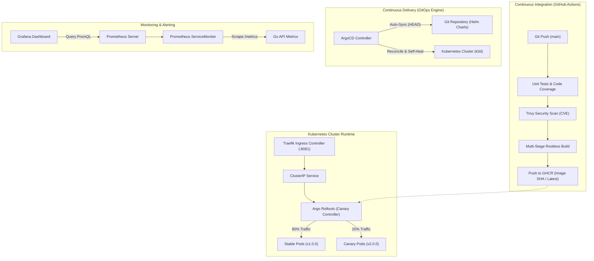
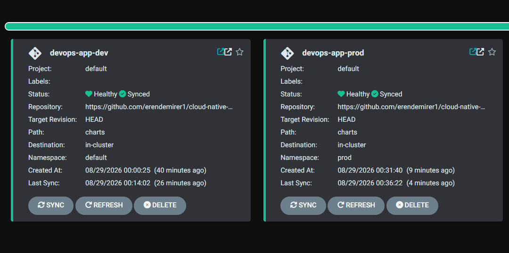
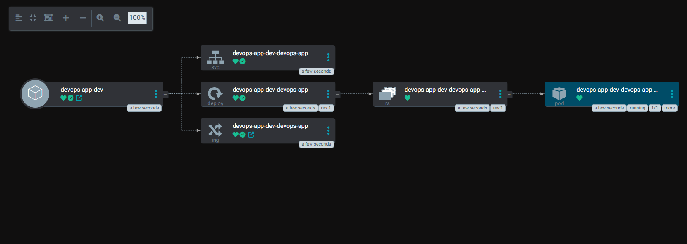
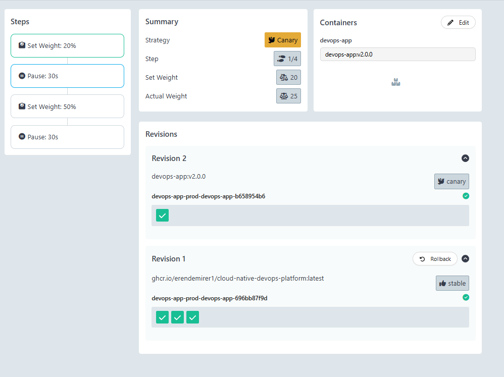
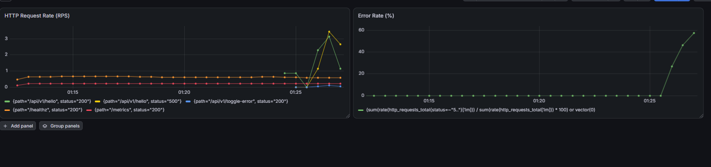

# Production GitOps Engine

Production-grade cloud-native microservice architecture demonstrating Trunk-Based Development, automated DevSecOps CI pipeline, Infrastructure as Code (Terraform), declarative GitOps deployment via ArgoCD, progressive Canary rollouts via Argo Rollouts, and full-stack observability with Prometheus and Grafana.

---

## Architecture Overview



---

## Tech Stack & Tooling

| Domain | Technology | Purpose |
| :--- | :--- | :--- |
| **Infrastructure as Code** | Terraform (>= 1.5) | Modular IaC for automated bootstrapping of ArgoCD, Rollouts, and Monitoring |
| **Backend Core** | Go 1.26 | Lightweight HTTP API with graceful shutdown and atomic error toggle |
| **Containerization** | Docker, Alpine Linux | Multi-stage, minimal (~30MB), rootless execution (UID 10001) |
| **CI / DevSecOps** | GitHub Actions, Trivy, GHCR | Automated linting, vulnerability scanning, and container registry publishing |
| **Packaging** | Helm 3 | Parameterized manifests with environment isolation (`dev` vs `prod`) |
| **Local Cluster** | k3d (k3s in Docker) | CNCF-certified lightweight Kubernetes cluster |
| **GitOps Engine** | ArgoCD | Declarative desired state management with automated self-healing |
| **Progressive Delivery** | Argo Rollouts | Canary deployments with automated weighting, step analysis, and rollbacks |
| **Observability** | Prometheus, Grafana | Scrapes RED metrics (`Rate`, `Errors`, `Duration`) via `ServiceMonitor` |

---

## Repository Structure

```text
.
├── .github/
│   └── workflows/
│       └── ci.yaml              # DevSecOps CI Pipeline (Test, Trivy scan, GHCR build/push)
├── terraform/                   # Infrastructure as Code (IaC) Bootstrapping Module
│   ├── versions.tf              # Provider constraints (Helm, Kubernetes)
│   ├── providers.tf             # Kubernetes & Helm provider configurations
│   ├── variables.tf             # Parameterized variables (namespaces, context)
│   ├── main.tf                  # Automated Helm releases for ArgoCD, Rollouts, Prometheus
│   └── outputs.tf               # Infrastructure DNS endpoints and status outputs
├── charts/                      # Production Helm Chart
│   ├── Chart.yaml               # Chart metadata
│   ├── values.yaml              # Base default values
│   ├── values-dev.yaml          # Development environment overrides (1 replica, Deployment)
│   ├── values-prod.yaml         # Production environment overrides (3 replicas, Rollout, HPA)
│   └── templates/
│       ├── _helpers.tpl         # Shared naming and standard label templates
│       ├── deployment.yaml      # Standard Deployment manifest (active when Rollout is disabled)
│       ├── rollout.yaml         # Argo Rollouts manifest (Canary strategy with 20% -> 50% steps)
│       ├── service.yaml         # Internal ClusterIP Service
│       ├── ingress.yaml         # External Traefik Ingress routing
│       ├── hpa.yaml             # Dynamic HorizontalPodAutoscaler (targets Rollout/Deployment)
│       └── servicemonitor.yaml  # Prometheus Operator ServiceMonitor for /metrics
├── gitops/
│   └── argocd/
│       ├── app-dev.yaml         # ArgoCD Application manifest for Development
│       └── app-prod.yaml        # ArgoCD Application manifest for Production
├── src/
│   ├── main.go                  # Server initialization, routing, and graceful shutdown
│   ├── handlers.go              # Healthcheck, API response, and error simulation handlers
│   ├── metrics.go               # Prometheus Counter & Histogram RED metric declarations
│   └── main_test.go             # Unit tests for HTTP endpoints and error toggling
├── docs/
│   └── screenshots/             # Verification and dashboard screenshots
├── Dockerfile                   # Multi-stage, rootless Dockerfile
├── go.mod
└── go.sum
```

---

## Getting Started

### Prerequisites

Ensure the following tools are installed locally:
- Docker (`>= 24.0`)
- `kubectl` (`>= v1.28`)
- `helm` (`>= v3.12`)
- `terraform` (`>= v1.5`)
- `k3d` (`>= v5.0`)
- `kubectl-argo-rollouts` plugin

### 1. Initialize Local Kubernetes Cluster

Create a lightweight k3d cluster with port forwarding configured for the Traefik load balancer:

```bash
k3d cluster create devops-cluster --port "8081:80@loadbalancer"
```

Verify cluster readiness:

```bash
kubectl get nodes
```

---

### 2. Install ArgoCD (GitOps Engine)

Deploy ArgoCD into the dedicated `argocd` namespace:

```bash
kubectl create namespace argocd
kubectl apply --server-side --force-conflicts -n argocd -f https://raw.githubusercontent.com/argoproj/argo-cd/stable/manifests/install.yaml
```

Retrieve the initial administrator password and forward the Web UI:

```bash
# Get decoded admin password
kubectl -n argocd get secret argocd-initial-admin-secret -o jsonpath="{.data.password}" | base64 -d; echo

# Access ArgoCD Web UI at https://localhost:8082
kubectl port-forward svc/argocd-server -n argocd 8082:443
```

Apply declarative GitOps applications:

```bash
kubectl apply -f gitops/argocd/app-dev.yaml
kubectl apply -f gitops/argocd/app-prod.yaml
```


*Figure 1: ArgoCD dashboard managing synchronized Dev and Prod environments.*


*Figure 2: Live resource topology mapping Ingress, Service, ReplicaSet, and running Pods.*

---

### 3. Install Argo Rollouts (Progressive Delivery)

Deploy the Argo Rollouts controller:

```bash
kubectl create namespace argo-rollouts
kubectl apply --server-side --force-conflicts -n argo-rollouts -f https://github.com/argoproj/argo-rollouts/releases/latest/download/install.yaml
```

Start the Rollouts management dashboard:

```bash
kubectl argo rollouts dashboard
# Access dashboard at http://localhost:3100
```

#### Canary Deployment Workflow

When releasing a new version (e.g., `v2.0.0`), Argo Rollouts executes the defined progressive strategy:
1. `setWeight: 20` – Routes 20% of traffic to the new revision.
2. `pause: 30s` – Evaluates health probes and system stability.
3. `setWeight: 50` – Increases traffic allocation upon passing checks.
4. `pause: 30s` – Final validation window before fully promoting to 100%.


*Figure 3: Active Canary deployment routing 20% traffic to Revision 2 while preserving Revision 1 stability.*

---

### 4. Deploy Monitoring Stack (Prometheus & Grafana)

Install `kube-prometheus-stack` to collect metrics and visualize runtime performance:

```bash
helm repo add prometheus-community https://prometheus-community.github.io/helm-charts
helm repo update

kubectl create namespace monitoring

helm install prometheus prometheus-community/kube-prometheus-stack \
  -n monitoring \
  --set grafana.adminPassword=admin \
  --set prometheus.prometheusSpec.serviceMonitorSelectorNilUsesHelmValues=false
```

Access Grafana:

```bash
kubectl port-forward svc/prometheus-grafana -n monitoring 3000:80
# Credentials: admin / admin
```


*Figure 4: Real-time RED metrics dashboard displaying Request Rate (RPS) and Error Rate spikes under injected load.*

---

## API Reference & Verification

The microservice exposes the following HTTP endpoints on port `8080` (mapped to `8081` via host Ingress):

| Endpoint | Method | Description |
| :--- | :--- | :--- |
| `/healthz` | `GET` | Kubernetes Liveness & Readiness probe (`{"status":"UP"}`) |
| `/api/v1/hello` | `GET` | Primary API endpoint returning JSON payload and active version |
| `/api/v1/toggle-error` | `POST` | Injects/clears simulated 500 errors for observability and rollback verification |
| `/metrics` | `GET` | Standard Prometheus metric scrape endpoint |

### Verification Commands

```bash
# 1. Check Service Health
curl http://localhost:8081/healthz

# 2. Query API Endpoint
curl http://localhost:8081/api/v1/hello

# 3. Simulate Error Injection (Trigger 500 Internal Server Errors)
curl -s -X POST http://localhost:8081/api/v1/toggle-error

# 4. Generate Traffic for Observability Dashboard
for i in {1..50}; do curl -s http://localhost:8081/api/v1/hello > /dev/null; sleep 0.05; done

# 5. Restore Normal Operations
curl -s -X POST http://localhost:8081/api/v1/toggle-error
```

---

## Security & Reliability Highlights

- **Non-Root Containerization:** The Go binary runs under UID `10001` (`appuser`) with read-only root filesystems and privilege escalation blocked at both Docker and Kubernetes `securityContext` levels.
- **Automated Vulnerability Scanning:** Every push triggers a Trivy security audit within GitHub Actions, failing builds on `HIGH` or `CRITICAL` CVEs.
- **GitOps Self-Healing:** ArgoCD actively detects configuration drift; unauthorized manual changes to live cluster resources are automatically reverted to match the Git specification.
- **Zero-Downtime Releases:** Automated Canary rollouts combined with HTTP health probes prevent faulty releases from affecting the broader user base.
